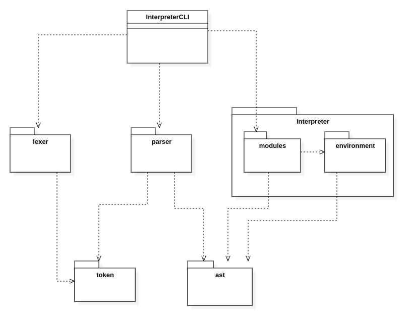

# Introduction

I defined my own statically typed programming language and wrote an interpreter for it. The language has a C-like syntax with a few modifications. The interpreter has a CLI, can handle recursion, has a few built-in functions and supports code block scopes. It uses a technique called tree-walk interpreting.

I learned a lot about interpreters and the project was a lot of fun. I also learned how to organize my code better and had a chance to use some design patterns like Fascade, Visitor and Iterator.

<br>

Here's a list of some features that the interpreter provides: 
- string and int data types
- semantic analysis that provides very descriptive error reports
- abstract syntax tree visualization
- code execution
- code block scopes
- built-in functions that provide a way to print to standard output and read from standard input
<br>
<br>

It comes with the 'tests' folder with some basic programs that showcase some of the interpreter's capabilities.

<br>

## Example

Here's an example of how a simple program might look like in the language

```c
// Handling recursion like it's nothing
int counter = 0;

fn int main(){
    string hello = "Hello ";
    print(hello + strReturner(""));
    print ("finished");
    return 1;
}

fn string strReturner(string y){
    counter = counter + 1;
    if(counter >= 20){
        return y;
    }
    return strReturner(y + " Hi"); 
}
```

And here's what the output looks like in the CLI:

```
Hello  Hi Hi Hi Hi Hi Hi Hi Hi Hi Hi Hi Hi Hi Hi Hi Hi Hi Hi Hi
finished

Finished: The program returned 1
```
<br>
<hr>
<br>
Here's another example of a program with some semantic errors

```c
1  // testing the interpreter's semantic error detection capabilities
2  string s = "global variable";
3
4  fn int fun(int someParam){
5     for(int x="nope"; x<3; x=x+1){
6         int m;
7     }
8
9     if(x == 3){
10       int b = 2 + strReturner("invalid arg type");
11       int inner = 2;
12    }
13    inner = 3;
14
15    fn int nestedFunc(){
16       return 1;
17    }
18 }
19
20 fn string strReturner(int x){
21    return 1;
22 }
```

And again, here's the output in the CLI

```
Line 0: Cannot execute without main() function
Line 4: Function 'fun' of type INT should have a return statement at the end
Line 5: Assigning a wrong type to variable 'x' . Expected INT ,but got STRING
Line 6: Cannot declare variables inside loops 'm'
Line 9: Using an undeclared variable x'
Line 9: Binary expression: Unmatching types UNDEFINED EQUAL INT
Line 9: If statement condition of wrong type. Expected INT, but got UNDEFINED
Line 10: Call to 'strReturner'' ==> Argument number 1 is of wrong type. Expected INT ,but got STRING
Line 10: Binary expression: Unmatching types INT PLUS STRING
Line 10: Assigning a wrong type to variable 'b' . Expected INT ,but got UNDEFINED
Line 13: Assigning to an undeclared variable 'inner'
Line 15: Nesting functions is not allowed 'nestedFunc'
Line 21: Invalid return type. Expected STRING ,but got INT
An error has occured during semantic analysis
```
As you can see, the interpreter works pretty well when it comes to detecting a faulty program.
<br>
<br>

# Language description


## Semantic rules

Here's a list of all of the rules imposed on the language:

1. The main() function must be present. It can return any data type (void, string or int) and mustn't have any parameters
2. Nesting function declarations is not allowed
3. Declaring variables inside loops is not allowed
4. We cannot declare the same variable or function name in the same block scope
5. Non-void type functions must have a return statement at the end that returns a value
6. We must use appropriate data types with appropriate operators
7. The interpreter provides a few built-in functions and their names are reserved
8. Function calls must be performed with appropriate number of arguments and argument types
9. Function calls cannot be used outside of any function (For example, we can't declare global variables like this ==>  int x = funcCall(); )


<br>
Not following any of these will ALWAYS be reported as an error.

<br>

## Built-in functions

I've built in a few basic functionalities in the language.<br>

Built-in function signatures:
```go
1. fn void print(string s)      
2. fn int readInt()
3. fn string readStr()
4. fn string intToStr(int x)
```


#### NOTE <br>
Function arguments are always passed by value, not by reference. This applies to every function, not just the built-in functions.<br>
Also, I should mention that I didn't add the 'break' statement into the language.

<br>

## Syntax definition


It <b>is not necessary</b> to understand the formal definition of the syntax to be able to use it intuitively. But, defining the syntax formally makes it a lot easier to write the parser module as we'll see in a bit. These formal rules are called 'production rules'. Every production rule we'll define here will translate into EXACTLY ONE parsing method in the parser module.<br>

#### NOTE
Despite all that, you don't have to look into the formal definitions here too much. It would probably be much easier to understand if you looked at the parsing methods themselves, instead.


<hr>


We need a metasyntax to describe the syntax of the language. Here's a brief explanation of the notation.
<br>


- unquoted words are non-terminals, which means they can be further decomposed
- quoted words (or symbols) are terminals which means they are taken as literals (they cannot be decomposed further)
- " * " means that the term before it can be repeated an arbitrary number of times
- "(  )" groups the terms inside it
- " | " means the same as OR
- " ? " means the term before it can appear 0 or 1 times

<br>
Here's the formal definition of the language's syntax

```
// PROGRAM
program -> declStmt*

// STATEMENTS
stmt -> exprStmt | declStmt | whileStmt | forStmt | ifStmt | retStmt 
exprStmt -> expression ';'                                                      
declStmt -> ( varDecl ';') | ('fn' funcDecl  )                             
whileStmt -> 'while' '(' expression ')' '{' stmt* '}'
forStmt -> 'for' '(' varDecl? ';' expression? ';' expression? ')' '{' stmt* '}'
ifStmt -> 'if' '(' expr ')' '{' stmt* '}'  
retStmt -> 'return' expression? ';'

// DECLARATIONS
varDecl -> ('int' | 'string') identifier ( '=' expression )? 
funcDecl -> ('int' | 'string' | 'void') identifier '(' (param (',' param)* )? ')' '{' stmt* '}'
param -> ('int' | 'string') identifier 

// EXPRESSIONS
expression -> assignment 
assignment -> (identifier '=')? equality                 
equality -> comparison ( equality_operator comparison )*
comparison -> addition ( comparison_operator comparison )*
addition -> multiplication ( addition_operator multiplication )*   
multiplication -> term ( multiplication_operator term )*
term -> unary_operator? primary
primary- > identifier
         | literal 
         | '(' equality ')'
         | identifier '(' identifier (',' identifier)* ')'
```
<br>
<br>

# Implementation

## Overview
I left a lot of comments in the code so I won't be going into too much detail on how exactly everything works.

The modules are divided into a few packages based on their responsibilities.


Here's a UML diagram of package dependencies ( A ----> B  means that package A imports package B )


<br>
<br>
The interpreter's packages can be grouped into two main subsystems:
<br>

1. "lexer" and "parser" packages that work with tokens 
2. "parser", "environment" and "modules" packages that work with abstract syntax trees (ast)

As you can see, the "parser" package serves as a bridge between these two subsystems. 
<br>

I tried my best to separate the responsibilities and to have the smallest number of dependencies between these packages.
<br>
<hr>

### Tokens and abstract syntax trees


In short, tokens are a way to group letters and symbols. Here's an example:
```c
int res = x >= 100;
```
The token list generated by my lexer would look something like this:
```
'int'    'res'    '='    'x'    '>='    '100'    ';'   
``` 
I used quotes to represent the groupings.

Abstract syntax tree is just an intermediate representation of some code generated from tokens. It is easier to work with when performing semantic analysis, code execution or code compilation then just working with tokens.
<br>
If you want a more detailed explanation you can google it.

<br>
Also, from now on I will only be using the term <b>'ast'</b> which is short for <b>'abstract syntax tree'.</b> 
<br>
The term <b>'ast node'</b> refers to some node class from the 'ast' package.
<br>


<br>
<hr>

### Workflow

First, here's the basic workflow decomposed into 6 phases: 
 
 1. The user interacts with the CLI and tells it to execute some file
 2. The CLI loads the file's contents and gives them to the lexer
 3. The lexer groups the letters and symbols into tokens and gives the list of tokens to the parser
 4. The parser groups the tokens into ast nodes and builds the ast. If it didn't detect any syntax errors, it gives the ast to the semantic analyzer from the "modules" package
5. The analyzer performs semantic analysis on the ast and reports any errors. If there are none, it gives the ast to the executor module, also from the "modules" package
6. The executor module executes the program by traversing and interpreting the ast

<br>
Now we'll go into a little more depth on how these modules work and cooperate,<br>
<br>


### Errors
Before going into what and how every module works, we should first distinct between two types of errors that I've defined in this project.
<br>
1. <b>Regular errors</b> that will be part of the normal workflow of the interpreter. These will often be reported or thrown on purpose. They represent errors in the code that is being interpreted, not internal errors or malfunctioning of the interpreter itself.<br>

2. <b>Internal interpreter errors</b> that will be reported and stop the interpreter immediately. I inserted them to make it easier to keep track of where something went wrong. They will be very informative if someone, for example, modifies the interpreter and something goes wrong.

<br>
<br>

<hr> 


### CLI class
It provides a basic interface for the user. It has a few commands available for running programs from the 'tests' folder. It prints out what the programs returned and if an error had occured during each phase.<br>
<b>AST printing mode</b> can be enabled from the CLI. This makes the interpreter print out the abstract syntax tree after parsing.

<br>
<hr>

### Lexer class
It's the simplest part of the interpreter. As previously mentioned, it just takes the plain text as input. Then it groups the letters and symbols into a more meaningful representation for our interpreter, the tokens.<br>
 It also skips comments, blank spaces and empty lines.
<br>

I defined an enum called TType to represent each type of token that the interpreter can understand and work with.

The Lexer throws an error if it encounters an unexpected symbol that cannot be a part of any token.

<br>
<hr>

### Parser class
So, the parser takes the token list from the lexer as input. As I had pointed out earlier, every production rule in the formal language syntax specification is going to translate into exactly one parsing method.
<br>

Here's how it works:
<br>
The parser that I used is called <b>LL(1) (lookahead) parser</b>. It is a top-down parser, meaning we start matching the production rules from the top of the hierarchy (In our case that rule is called <b>program</b>).
```
// PROGRAM
program -> declStmt*
```  
So basically, our parsing journey starts with calling the <b>parseProgram()</b> method.
<br>

Keep in mind that some rules can take multiple routes like this one:
```
declStmt -> ( varDecl ';') | ('fn' funcDecl )                             
```
Here we look at the current token and check if it matches the 'fn'. If yes, we're sure that we are currently parsing a function declaration, so we call <b>parseFuncDecl()</b>. If not, we call <b>parseVarDecl()</b> . 
<br>

The <b>1</b> in LL(1) means that in some production rules, just looking at the current token won't be enough to decide where to go next and we will have to peek at the 1 token ahead to decide which production to choose.
<br>

Not every production rule will necesserily produce a different type of ast node.
<br>
<br>

<hr>

### environment package

#### BuiltIns 
This class contains the definitions of every built-in function. It also provides a unique interface through which we can call any built in function from the Executor class.<br>
Adding more built-in functions is a pretty straightforward process. We just need to modify this class a little and nothing else. 

#### DeclarationTable
This class acts like our symbol table. We can declare a variable (or a function) under some name. We also fetch it by it's name. It also provides a way to work with code block scopes.
<br>
This class provides only basic functionalities and isn't used by the "modules" package directly. Instead the <b>Environment</b> class acts as a fascade for the DeclarationTable.

#### Environment
This class handles of our function and variable declarations by using the <b>DeclarationTable</b> class. It also keeps track of our function call stack, and the global and active local scopes.
<br>
It isn't intended to do any error checking or reporting. So if an error occurs, it will just throw an internal error. It is up to the user of the Environment class to handle it properly.
<hr>

### modules package

All three modules inside this package must traverse the ast to do their jobs and they use the visitor pattern to do so. We implement the <b>ASTVisitor</b> interface in all three modules and every ast node implements the <b>ASTNode</b> interface that contains the <b>accept( ASTVisitor v )</b> method. 


#### AstPrinter
AstPrinter is only invoked if the AST print mode is enabled in the CLI. It is quite simple and just prints the ast in a readable format.

#### SemanticChecker
The SemanticChecker passes through the ast only once and reports any errors. It uses the Environment class to perform some of these checks. All of the semantic rules listed in the introduction are imposed by this class.<br>
 We performs all these checks here, so that the Executor class can just execute the ast nodes without worrying if it's accidentally, for example, trying to add an int to a string. 

#### Executor
This is the class that actually executes the ast nodes. The technique is called Tree-walk interpreter, because we execute the ast nodes directly. No compilation is performed. It uses the Environment class to declare and fetch variables and functions. 
<br>
An interesting thing about this class is that we execute return statements by wrapping the return value into an excetion and then throwing it. We catch this specific type of exception and extract the returned value. 
<br>
I implemented it this way because functions can have multiple return statements, and the control flow could go many ways. So, the first thing that came to mind is to exploit the exception mechanism of the Java language. 
